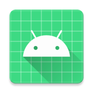

<div align="center">



# MyAwesomeRecipe

**A Kotlin Multiplatform app sharing business logic (and Compose UI on Android) across Android and iOS.**


</div>

---

## Overview

MyAwesomeRecipe is a [Kotlin Multiplatform (KMP)](https://www.jetbrains.com/help/kotlin-multiplatform-dev/get-started.html) project targeting **Android** and **iOS**. Shared code lives under the package `com.example.myawesomerecipe`. Business logic is written once in Kotlin and consumed by both platforms; the Android app additionally renders a shared **Compose Multiplatform** UI, while iOS hosts its own **SwiftUI** and reuses only the shared logic.

## Tech stack

| Area | Technology | Version |
|------|-----------|---------|
| Language | Kotlin | 2.4.0 |
| Shared UI | Compose Multiplatform | 1.11.1 |
| Android build | Android Gradle Plugin | 9.2.1 |
| Networking | Ktor client | 3.5.1 |
| Serialization | kotlinx.serialization | — |
| Persistence | SQLDelight | 2.3.2 |
| Concurrency | kotlinx.coroutines | 1.11.0 |
| Presentation | AndroidX lifecycle-viewmodel | — |
| Android SDK | compileSdk 37 · minSdk 26 · targetSdk 36 | — |

Dependency and plugin versions are centralized in the Gradle version catalog: [`gradle/libs.versions.toml`](gradle/libs.versions.toml).

## Project structure

```
MyAwesomeRecipe/
├── androidApp/     Android application (entry point, MainActivity → App())
├── iosApp/         Native SwiftUI application (links the SharedLogic framework)
├── sharedLogic/    KMP library: business logic + platform abstraction
├── sharedUI/       Compose Multiplatform UI library (Android target today)
└── gradle/         Version catalog & wrapper
```

### Modules

- **`sharedLogic`** — Kotlin Multiplatform library holding the shared business logic. Compiles for Android and iOS and exposes a **static iOS framework named `SharedLogic`** (`iosArm64`, `iosSimulatorArm64`). Ktor, kotlinx.serialization, coroutines, and SQLDelight are wired here.
- **`sharedUI`** — Compose Multiplatform UI library. Depends on `sharedLogic` (`api(projects.sharedLogic)`) and defines the shared `App()` composable. **Currently Android-only** (no iOS target declared yet).
- **`androidApp`** — Android application. Depends on `sharedUI`; `MainActivity` sets `App()` as its content.
- **`iosApp`** — Native SwiftUI application. Links the `SharedLogic` framework **directly** and calls `Greeting().greet()` from `ContentView.swift`. This is also where you add SwiftUI code.

## Architecture

**Platform abstraction (`expect`/`actual`).** `sharedLogic` declares platform-specific behavior in common code and implements it per target:

- `commonMain/Platform.kt` — `interface Platform` + `expect fun getPlatform()`
- `androidMain/Platform.android.kt` — Android `actual` (reports `Build.VERSION.SDK_INT`)
- `iosMain/Platform.ios.kt` — iOS `actual` (reports `UIDevice` name/version)

`Greeting.greet()` in `commonMain` is the shared entry point both apps call.

Three more `expect`/`actual` pairs follow the same pattern in `sharedLogic`:

- **`RecipeStorage`** — favourites persistence. `androidMain` uses `SharedPreferences`, `iosMain` uses `NSUserDefaults`.
- **`createHttpClient()`** (`repository/HttpClient.kt`) — Ktor client factory. `androidMain` uses the OkHttp engine, `iosMain` uses the Darwin engine; both install `ContentNegotiation` with kotlinx JSON.
- **`DatabaseDriverFactory`** — a plain interface (not `expect`) implemented per platform to supply the SQLDelight `SqlDriver`.

**Data / domain / presentation layers.** `sharedLogic/commonMain` is organized into `model/` (`MealModel`, the serializable `MealDTO`/`MealResponse` with `toModel()`, and `UiState`), `repository/` (`MealRepository` + `MealRepositoryImpl`), `presentation/` (`MealViewModel` exposing a `StateFlow<UiState>`), and `cache/` (SQLDelight `Database` wrapper over the `Meal` table in `RecipeDatabase.sq`). These layers are **partially wired**: `MealRepositoryImpl.fetchMeals()` now fetches from [TheMealDB](https://themealdb.com) over Ktor and maps the response to `MealModel`, but `MealViewModel.fetchMeals()` is still a stub that never calls the repository, `favorites()` is `TODO()`, and the SQLDelight cache / `RecipeStorage` are not yet exercised.

**UI topology.** The shared Compose UI runs on **Android only**. iOS uses native SwiftUI and consumes just `sharedLogic`. To share the Compose UI on iOS, add iOS targets and a framework to `sharedUI/build.gradle.kts` and wire it into the Xcode project.

## Requirements

- JDK 11 or newer
- Android SDK (compileSdk 37)
- Xcode (for building and running the iOS app)

## Getting started

Clone the repo and open it in Android Studio / IntelliJ IDEA (with the Kotlin Multiplatform plugin) or use the Gradle wrapper directly.

### Run the Android app

```bash
./gradlew :androidApp:assembleDebug
```

Or use the run configuration from your IDE's run widget.

### Run the iOS app

Open [`iosApp/iosApp.xcodeproj`](iosApp) in Xcode and run it on a simulator or device. Xcode drives the build of the `SharedLogic` framework.

## Testing

```bash
# Android host (unit) tests
./gradlew :sharedLogic:testAndroidHostTest :sharedUI:testAndroidHostTest

# iOS simulator tests
./gradlew :sharedLogic:iosSimulatorArm64Test

# Everything
./gradlew check
```

Run a single host test with the `--tests` filter:

```bash
./gradlew :sharedLogic:testAndroidHostTest --tests "com.example.myawesomerecipe.SharedLogicAndroidHostTest.example"
```

## Notes

- **Version catalog is the source of truth.** Add or bump dependencies in [`gradle/libs.versions.toml`](gradle/libs.versions.toml), referenced as `libs.<alias>`; reference modules with the typesafe accessor `projects.<module>`.
- **Ktor is wired end-to-end in the repository; SQLDelight is still scaffolding.** `MealRepositoryImpl` calls the `createHttpClient()` factory (OkHttp on Android, Darwin on iOS) to fetch from TheMealDB. `ContentNegotiation` needs the separate `ktor-client-content-negotiation` dependency (alongside `ktor-serialization-kotlinx-json`). SQLDelight has a schema (`RecipeDatabase.sq` — `Meal` table with insert/select/delete queries) and platform drivers but is not yet consumed. The `MealViewModel` and the direct Ktor call in `Greeting.kt` remain stubs/commented out.
- **Gradle configuration cache and build cache are enabled** (`gradle.properties`). When iterating on build logic you may need `--no-configuration-cache`.
- All modules target `JvmTarget.JVM_11`.

## License

No license file is currently included in this repository.
